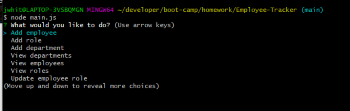

# Employee Tracker

- View the GitHub [repository](https://github.com/Jessica264365/Employee-Tracker)
- View a video of the [application in action](https://drive.google.com/file/d/1g1kwG3j2CnWHpKJqzDSiKIXNbI_lK90x/view)

## Table of Contents

- [About the Project](https://github.com/Jessica264365/Employee-Tracker#about-the-project)

* [Start Your Own](https://github.com/Jessica264365/Employee-Tracker#start-your-own)
  - [Prerequisites](https://github.com/Jessica264365/Employee-Tracker#prerequisites)
  - [Installation](https://github.com/Jessica264365/Employee-Tracker#installation)

- [Test Instructions](https://github.com/Jessica264365/Employee-Tracker#test-instructions)
- [License](https://github.com/Jessica264365/Employee-Tracker#license)
- [Roadmap](https://github.com/Jessica264365/Employee-Tracker#roadmap)
- [Contribute](https://github.com/Jessica264365/Employee-Tracker#contribute)
- [My Contact Information](https://github.com/Jessica264365/Employee-Tracker#my-contact-information)

## About the Project

This is a simple content management system command line application. Users can add an employee, create a new department or role and edit those employee roles should they need to. This application also allows the user to view all employees, view all departments and view all roles. The console.table function is used to display all the employees, roles and departments in an easy to view fashion. If an employee switches roles or managers there is an option to update that information in the database. Once the user is done with the application they can select the exit option which will end the application. This application comes with the employeetracker.sql which sets up the database in MySQL. There is also some seed data available if it is needed. Refer to the top for a video of the application in action.

 

## Start Your Own

To get a copy of this project on your local computer please follow these next steps.

### Prerequisites

To use this application the user must be familiar with the MySQL Workbench and Node.js.

Clone the GitHub repository: git@github.com:Jessica264365/Employee-Tracker.git

### Installation

To get started go to the directory with the package.json file in your terminal and install all the dependencies. Copy the information in the employeetracker.sql and run it in your MySQL Workbench. This sets up the database. Make sure to enter your own password for your MySQL on line 16 in "main.js". Then run the application in node by typing in "node main.js". Once that application is running you should be able to create a department, roles for that department and employees for the roles. There is also some seed data in seed.sql that you can also use to test out the application.

### Test Instructions

There are currently no test for this application.

## License

### MIT License

A short and simple permissive license with conditions only requiring preservation of copyright and license notices. Licensed works, modifications, and larger works may be distributed under different terms and without source code.

## Roadmap

This project does not currently have an open issues. Please check the [issues](https://github.com/Jessica264365/Employee-Tracker/issues) page on GitHub for any updates.

## Contribute

Feel free to create a pull request. If you are making major changes please open an issue so it can be discussed.

## My Contact Information

Email: jwhitman135@outlook.com

GitHub Page: [Jessica264365](https://github.com/Jessica264365)
